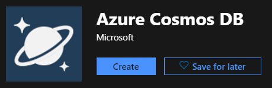
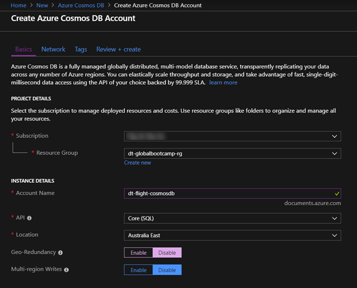

# Real Time Flight Maps w/ Azure Functions, CosmosDB & SignalR

## What we will cover

In this workshop we will be building a realtime flight tracker app that levarges several Azure technonlogies.

- We will be using Azure Maps to draw the map canvas in our web app.
- To get the flight information, we will create a timer triggered Azure Function to pull the latest flight data set from the OpenSkys public API. The flight data will then be persisted in a Cosmos Database.
- We will then create an Azure Function that listens to the Cosmos DB change feed and updates an Azure SignalR hub with all changes to flight data. 
- The web app will be configured with a SignalR client to handle the data changes in realtime.

## What you will need

- Microsoft Azure Account
- Visual Studio 2017
- Azure Function CLI Tools *(Will be downloaded automatically when debugging functions locally)*

## Azure Maps

[**Azure Maps from the docs**](https://docs.microsoft.com/en-us/azure/azure-maps/about-azure-maps)

*Azure Maps is a portfolio of geospatial services that include service APIs for Maps, Search, Routing, Traffic and Time Zones. The portfolio of Azure OneAPI compliant services allows you to use familiar developer tools to quickly develop and scale solutions that integrate location information into your Azure solutions. Azure Maps provides developers from all industries powerful geospatial capabilities packed with fresh mapping data imperative to providing geographic context to web and mobile applications.*

### Create a new Azure Maps resource

1. In the upper left corner of the portal, click on 
2. Type in **Maps** in the search bar and select **Maps** in the dropdown.
3. Click the **Create** button that appears on the Maps resource page

    

4. Enter the following information into the **Create Maps Account** template

    | Name              | Value |
    | ---               | ---   |
    | Subscription      | Select your subscrption
    | Resource Group    | Select the resource group created above
    | Name              | Give your maps account a meaningful name
    | Pricing Tier      | Select **Standard S0** [See Pricing Info](https://azure.microsoft.com/en-us/pricing/details/azure-maps/)

5. Read the **License and Privacy Statement** and select the checkbox.

    

6. Once the new Azure Maps resource has been provision, navigate to the newly deployed resource and locate the **Authentication** tab under the **Settings** subheading. You will need to grab the key later on.

## Azure SignalR

[**Azure SignalR from the docs**](https://docs.microsoft.com/en-us/azure/azure-signalr/signalr-overview)

*Azure SignalR Service is an Azure managed PaaS service to simplify the development, deployment and management of real time web application using SignalR, with Azure supported SLA, scaling, performance and security. The service provides API/SDK/CLI/UI, and rich set of code samples, templates, and demo applications.*

### Create a new Azure SignalR resource

1. In the upper left corner of the portal, click on 
2. Type in **SingalR** in the search bar and select **SignalR Service** in the dropdown.
3. Click the **Create** button that appears on the SignalR Service resource page

    

4. Enter the following information into the **Create SignalR Service** template

    | Name              | Value |
    | ---               | ---   |
    | Resource Name     | Give your SignalR Service a meaningful name
    | Subscription      | Select your subscrption
    | Resource Group    | Select the resource group created above
    | Location          | Select a location to deploy your SignalR Service too
    | Pricing Tier      | Select the **Free** tier [See Pricing Info](https://azure.microsoft.com/en-us/pricing/details/signalr-service/)
 
    

5. Once the new SignalR Service has been provision, navigate to the newly deployed resource and locate the **Keys** tab under the **Settings** subheading. You will need to grab the connection string later on.

## Azure Cosmos DB

[**Azure Cosmos DB from the docs**](https://docs.microsoft.com/en-us/azure/cosmos-db/introduction)

*Azure Cosmos DB is a fully managed, globally-distributed, horizontally scalable in storage and throughput, multi-model database service backed up by comprehensive SLAs. Azure Cosmos DB was built from the ground up with global distribution and horizontal scale at its core - it offers turn-key global distribution across any number of Azure regions by transparently scaling and replicating your data wherever your users are. You can elastically scale throughput and storage worldwide and pay only for the throughput and storage you need. Azure Cosmos DB guarantees single-digit millisecond latencies at the 99th percentile anywhere in the world, offers multiple well-defined consistency models to fine-tune for performance and guaranteed high availability with multi-homing capabilities - all backed by industry leading service level agreements (SLAs).*

*Azure Cosmos DB is truly schema-agnostic - it automatically indexes all the data without requiring you to deal with schema and index management. Azure Cosmos DB is multi-model - it natively supports document, key-value, graph and columnar data models. With Azure Cosmos DB, you can access your data using NoSQL APIs of your choice. Azure Cosmos DB is a fully managed, enterprise ready and trustworthy service. All your data is fully and transparently encrypted and secure by default. Azure Cosmos DB is ISO, FedRAMP, EU, HIPAA, and PCI compliant as well.*

### Create a new Azure Cosmos DB instance

1. In the upper left corner of the portal, click on 
2. Type in **Cosmos** in the search bar and select **Azure Cosmos DB** in the dropdown.
3. Click the **Create** button that appears on the Azure Cosmos DB resource page

    

4. Enter the following information into the **Create Azure Cosmos DB** template

    | Name              | Value |
    | ---               | ---   |
    | Subscription      | Select your subscrption
    | Resource Group    | Select the resource group created above
    | Account Name      | Give your Cosmos DB a meaningful name
    | API               | Select the Core(SQL) API
    | Location          | Select a location to deploy your Cosmos DB too
    | Geo-Redundancy    | Not required so I chose to disabled it
    | Multi-Region      | Not required so left disabled by default
 
    

5. Click **Review + Create** and then once the validation has passed, select **Create**

6. Once the new Cosmos DB instance has been provision, navigate to the newly deployed resource and locate the **Keys** tab under the **Settings** subheading. You will need to grab the connection string later on.

### Nuget Packages

- Microsoft.Azure.WebJobs.Extensions.CosmosDB
- Microsoft.Azure.WebJobs.Extensions.SignalRService