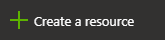
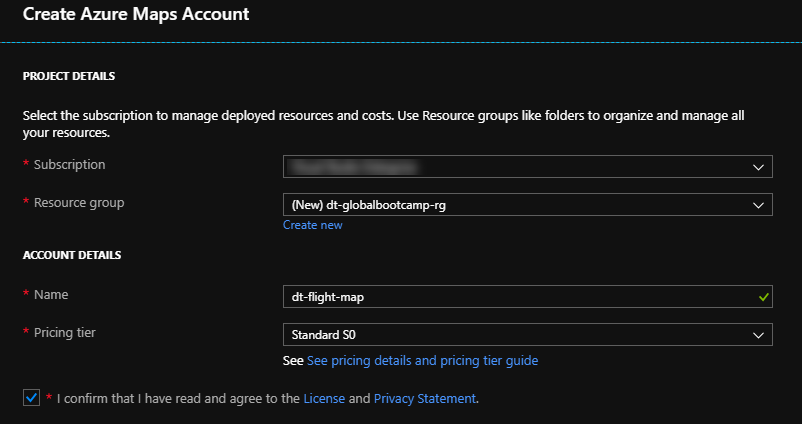

# Real Time Flight Maps w/ Azure Functions, CosmosDB & SignalR

## What we will cover

In this workshop we will be building a realtime flight tracker app that levarges several Azure technonlogies.

- We will be using Azure Maps to draw the map canvas in our web app.
- To get the flight information, we will create a timer triggered Azure Function to pull the latest flight data set from the OpenSkys public API. The flight data will then be persisted in a Cosmos Database.
- We will then create an Azure Function that listens to the Cosmos DB change feed and updates an Azure SignalR hub with all changes to flight data. 
- The web app will be configured with a SignalR client to handle the data changes in realtime.

## What you will need

- Microsoft Azure Account
- Visual Studio 2017
- Azure Function CLI Tools *(Will be downloaded automatically when debugging functions locally)*

## Azure Maps

[**Azure Maps from the docs**](https://azure.microsoft.com/en-us/services/azure-maps/)

`Azure Maps is a portfolio of geospatial services that include service APIs for Maps, Search, Routing, Traffic and Time Zones. The portfolio of Azure OneAPI compliant services allows you to use familiar developer tools to quickly develop and scale solutions that integrate location information into your Azure solutions. Azure Maps provides developers from all industries powerful geospatial capabilities packed with fresh mapping data imperative to providing geographic context to web and mobile applications.`

### Create a new Azure Maps resource

1. In the upper left corner of the portal, click on 
2. Type in **Maps** in the search bar and select **Maps** in the dropdown.
3. Click the **Create** button that appears on the Maps resource page

    

4. Enter the following information into the **Create Maps Account** template

    | Name              | Value |
    | ---               | ---   |
    | Subscription      | Select your subscrption
    | Resource Group    | Select the resource group created above
    | Name              | Give your maps account a meaningful name
    | Pricing Tier      | Select **Standard S0** [See Pricing Info](https://azure.microsoft.com/en-us/pricing/details/azure-maps/)

5. Read the **License and Privacy Statement** and select the checkbox.

    

6. Once the new Azure Maps resource has been provision, navigate to the newly deployed resource and select the **Settings Section** on the **Account Tab**. From there make a mental note of the **Keys Tab** as we will need to grab that key later on.

## Azure SignalR

[**Azure SignalR from the docs**](https://azure.microsoft.com/en-us/services/signalr-service/)

`Azure SignalR Service is an Azure managed PaaS service to simplify the development, deployment and management of real time web application using SignalR, with Azure supported SLA, scaling, performance and security. The service provides API/SDK/CLI/UI, and rich set of code samples, templates, and demo applications.`

### Nuget Packages

- Microsoft.Azure.WebJobs.Extensions.CosmosDB
- Microsoft.Azure.WebJobs.Extensions.SignalRService